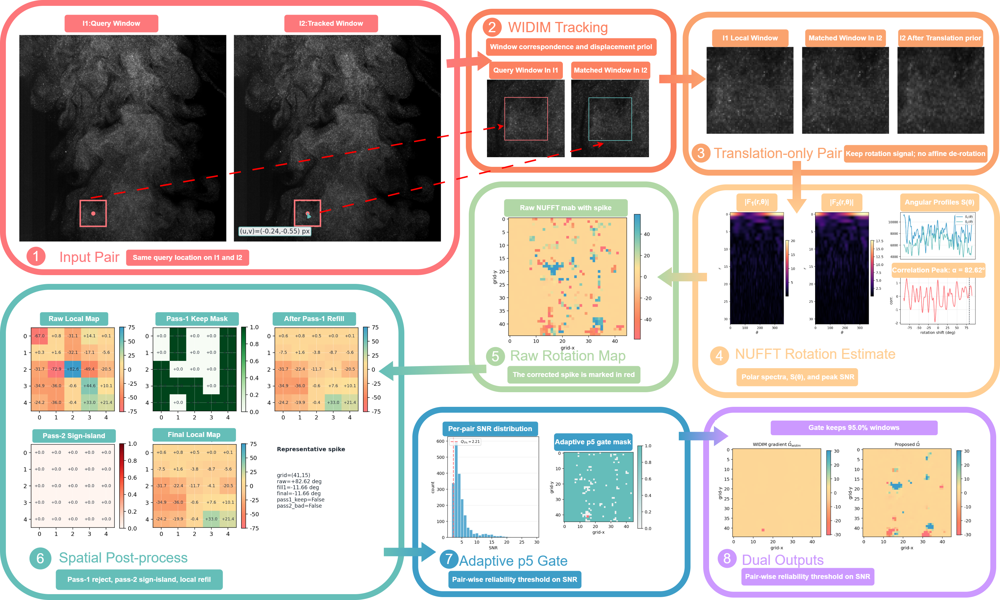

<div align="center">

# WIDIM-NUFFT

**Direct Local Rotation-Rate Measurement for Particle Image Velocimetry via Spectral Angular-Shift Estimation**

[](paper/manufacture.tex)
[](paper/manufacture.pdf)
[](paper/appendix_supporting_material.pdf)
[](data)



</div>

## Overview

This repository contains the manuscript, code, data organization, and representative results for **WIDIM-NUFFT**, a practical pipeline for direct local rotation-rate measurement in particle image velocimetry (PIV). The method combines:

- `WIDIM(track)` for window localization and translation priors,
- a spectral angular-shift estimator for direct local rotation-rate measurement,
- adaptive percentile gating and spatial refill for deployment on real PIV data.

The repository is organized to support both **paper reproduction** and **code/data release**.

## Highlights

- Direct local rotation-rate estimation instead of displacement-gradient differencing as the primary measurement path.
- Synthetic ground-truth validation on Rankine, Lamb-Oseen, solid-body rotation, and linear-shear control cases.
- Near-real truth bridge benchmark for truth-preserving evaluation under realistic rendering conditions.
- Real-data evaluation on pooled public datasets from the PIV Challenge and the PIV book vortex-ring archive.
- Supplementary structure-based validation on the vortex-ring case `cam2_5001`.

## Repository Layout

```text
WIDIM-NUFFT/
├── paper/                 manuscript, supplement, bibliography, and paper figures
├── code/
│   ├── core/              core estimators, baselines, and synthetic truth experiments
│   ├── bridge/            near-real truth bridge benchmark
│   ├── figures/           figure-generation scripts
│   └── runs/              batch-running scripts for real-data experiments
├── data/
│   ├── examples/          representative real-data and bridge-case inputs
│   ├── real_vortex/       full real-data release
│   └── bridge_synthetic/  full bridge benchmark inputs
└── results/
    ├── synthetic_gt_examples/
    ├── bridge_benchmark/
    ├── real_data_summary/
    ├── real_vortex_all_p5/
    └── structure_validation/
```

## Paper Files

- Main manuscript source: [`paper/manufacture.tex`](paper/manufacture.tex)
- Main manuscript PDF: [`paper/manufacture.pdf`](paper/manufacture.pdf)
- Supplementary PDF: [`paper/appendix_supporting_material.pdf`](paper/appendix_supporting_material.pdf)
- Bibliography: [`paper/refs.bib`](paper/refs.bib)

## Code Modules

- `code/core/`: direct estimator, WIDIM baseline, CRLB analyses, and synthetic truth experiments.
- `code/bridge/`: near-real truth bridge generator, renderer, metrics, and evaluation scripts.
- `code/figures/`: all scripts used to regenerate the paper figures.
- `code/runs/`: batch scripts for large-scale real-data processing.

## Data and Results

All original data, representative example inputs, and processed results associated with this study are released through this repository. Public-source provenance and download mirrors are summarized in [`real_data_sources.txt`](real_data_sources.txt).

Representative contents already organized here include:

- synthetic ground-truth maps and metrics,
- near-real truth bridge cases and aggregated metrics,
- processed real-data summary tables and plots,
- local structure-validation outputs for `cam2_5001`.

## Reproduction Notes

1. Compile the manuscript from `paper/manufacture.tex`.
2. Regenerate figures from `code/figures/` if needed.
3. Run bridge experiments from `code/bridge/`.
4. Run real-data experiments from `code/runs/run_real_vorticity_all_p5.py`.

## Real-Data Sources

The real-data evaluation pools public cases from:

- PIV Challenge Case A
- PIV Challenge Case C
- PIV Challenge Case E
- PIV Challenge Case F
- PIV book vortex-ring archive

The source links used for the paper release are listed in [`real_data_sources.txt`](real_data_sources.txt).

## Citation

If you use this repository, cite the manuscript in `paper/manufacture.pdf`.
